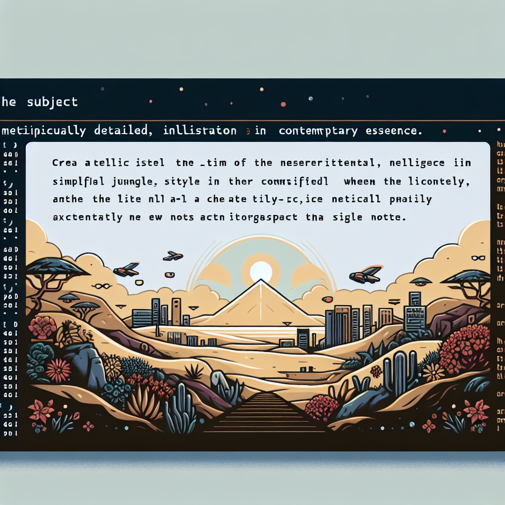

# Perplexity CLI

A command-line interface for interacting with Perplexity AI, with local note-taking and AI-powered search capabilities.



## Features

- 🤖 Direct interaction with Perplexity AI models
- 📝 Local note-taking system with tags
- 🔍 AI-powered semantic search across your notes
- � RAG (Retrieval Augmented Generation) for context-aware answers
- � Secure API key management
- 🎯 Multiple model support (small, large, huge)

## Installation

```bash
pip install pplx-cli
```

## Configuration

Set up your Perplexity API key:

```bash
perplexity setup
```

Or set the environment variable:
```bash
export PERPLEXITY_API_KEY='your-api-key'
```

## Usage

### Basic AI Interaction
```bash
# Ask a question
perplexity ask "What is Python?"

# List available models
perplexity list-models

# Use a specific model
perplexity ask "What is Python?" --model large
```

### Note Management
```bash
# Add a note
perplexity note --title "Python Tips" --content "List comprehension syntax: [x for x in list]" --tag python

# List all notes
perplexity list-notes

# List notes with specific tag
perplexity list-notes --tag python

# View a specific note
perplexity view-note 1
```

### AI-Powered Note Search (RAG)
```bash
# Ask questions about your notes
perplexity ask-notes "How do I use list comprehension?"

# Customize number of relevant notes to consider
perplexity ask-notes "What are Python tips?" --top 5
```

### Custom Notes Directory
All commands support a custom notes directory:
```bash
perplexity note --title "Meeting Notes" --content "..." --dir ~/my-notes
perplexity ask-notes "What was discussed?" --dir ~/my-notes
```

## Features in Detail

### Note Storage
- Notes are stored locally in SQLite database
- Each note includes title, content, tags, and timestamps
- Automatic embedding generation for semantic search
- Default location: `~/.local/share/perplexity/notes`

### RAG Implementation
- Uses lightweight MiniLM model (22MB) for embeddings
- Lazy loading to minimize resource usage
- Vector similarity search for finding relevant notes
- Fallback mechanisms for resource-constrained environments

### Available Models
- `small`: llama-3.1-sonar-small-128k-online (8B parameters)
- `large`: llama-3.1-sonar-large-128k-online (70B parameters)
- `huge`: llama-3.1-sonar-huge-128k-online (175B parameters)

## Requirements
- Python 3.12 or higher
- Internet connection for AI features
- ~25MB disk space for embedding model

## Contributing

Contributions are welcome! Please feel free to submit a Pull Request.

## License

This project is licensed under the MIT License - see the LICENSE file for details.
